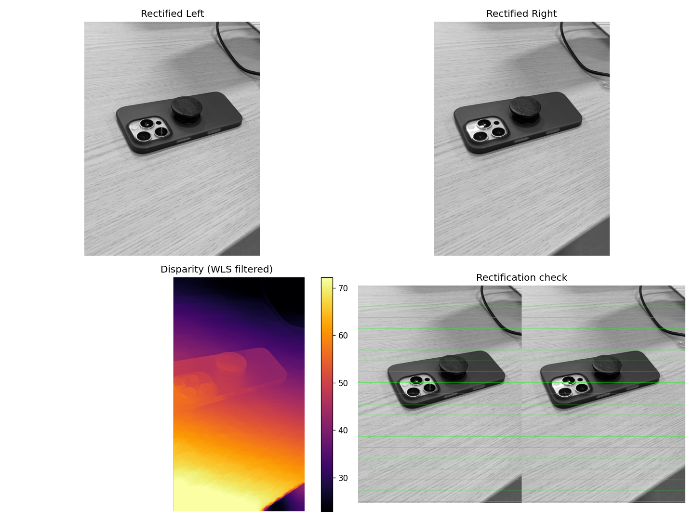

# depth-estimation

DL を使わない古典的ステレオマッチング（SGBM + WLS）で、2枚のステレオ画像から視差マップを生成するパイプライン。



上段：平行化済みの左右画像 / 左下：WLS フィルタをかけた視差マップ（明るいほど近い）/ 右下：平行化の検証（緑の水平線上で左右の特徴が揃っているか）。

参考: [Teledyne - Enhancing stereo depth estimation with deep learning techniques](https://www.teledynevisionsolutions.com/ja-jp/learn/learning-center/machine-vision/enhancing-stereo-depth-estimation-with-deep-learning-techniques/)

## パイプライン

1. 入力画像をダウンサンプリング
2. SIFT + FLANN で特徴点対応、Lowe's ratio test でフィルタ
3. EXIF の 35mm 換算焦点距離から内部パラメータ K を推定
4. `findEssentialMat` → `recoverPose` で相対姿勢を復元
5. `stereoRectify` + `remap` で平行化
6. `StereoSGBM` + WLS フィルタで視差マップを生成

## 必要環境

- Python 3.13
- [uv](https://docs.astral.sh/uv/)

## 使い方

```bash
uv sync
# left.JPG, right.JPG をこのディレクトリに置く
uv run python main.py
```

実行すると `output.png` に可視化結果（平行化済み左右、視差マップ、平行化チェック）が保存されます。

## 入力画像の前提

- ステレオペア（左右に少し視点をずらした2枚）
- iPhone など EXIF に `FocalLengthIn35mmFilm` を持つ機種で撮影
  - 別機種の場合は [main.py](main.py) の焦点距離推定部分を調整してください
- 平行移動が主で、極端な回転・視点差がないこと

## 出力について

視差マップは**相対的**な奥行きを表します。絶対距離 [m] を得るには、撮影時の2点間距離（ベースライン B）を実測し、`depth = f * B / disparity` で変換してください。
